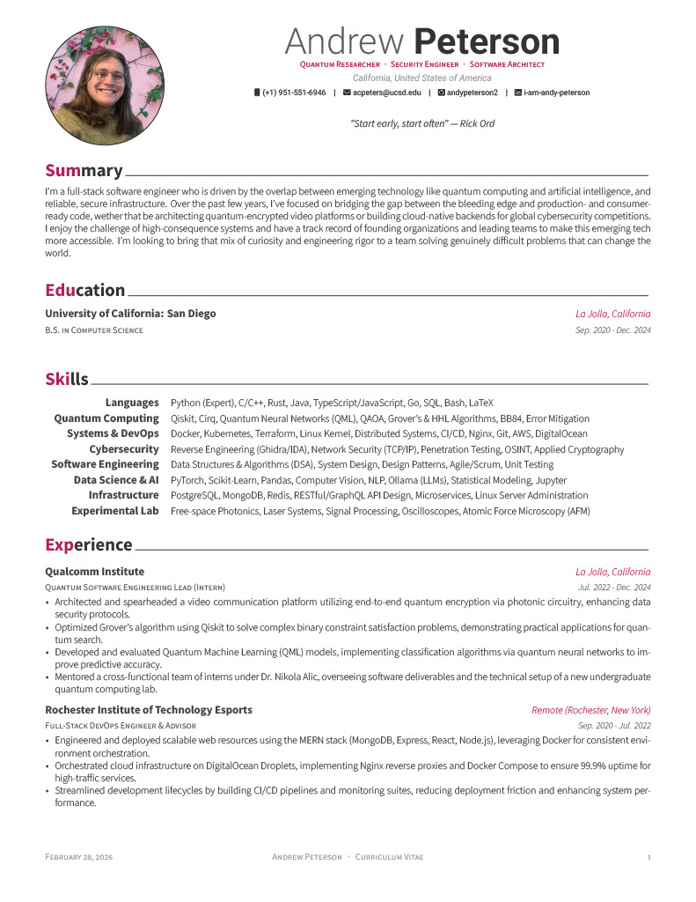
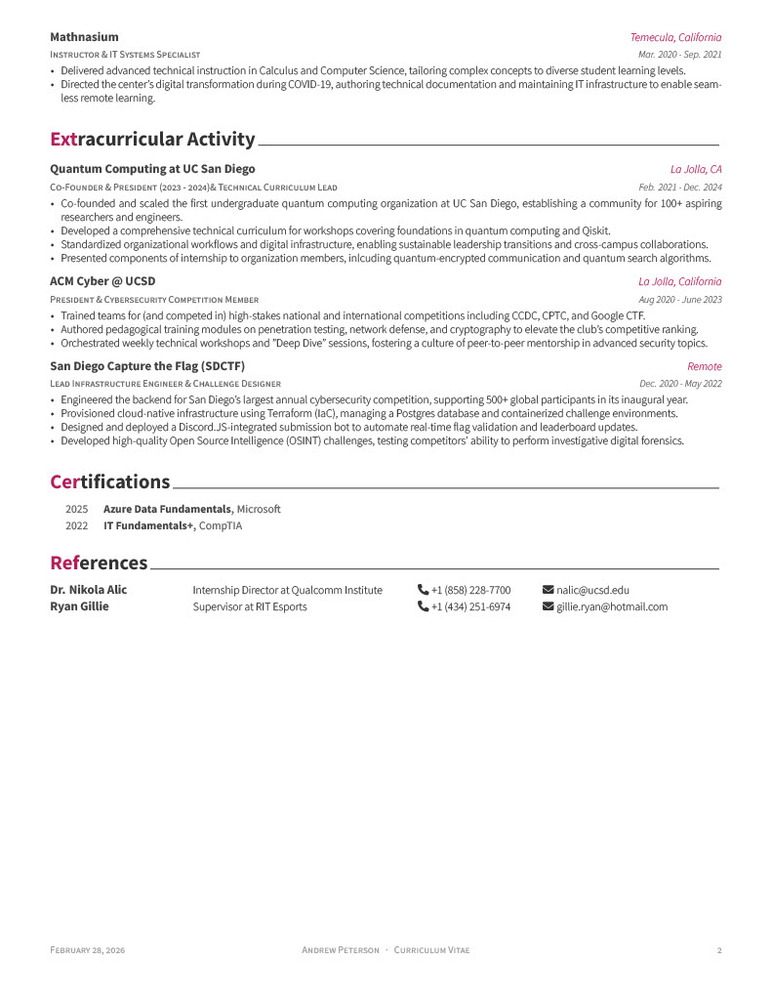

# cv

My CV, typed up in LaTeX for my own editing purposes. I'm using Awesome-CV as a base, which you can find maintained [here](https://github.com/posquit0/Awesome-CV).

Necessary fonts: [Roboto](https://fonts.google.com/specimen/Roboto) and [Source Sans Pro/3](https://fonts.google.com/specimen/Source+Sans+3)

## My CV

[Click here for the `.pdf`!](cv.pdf)

## My Resume

TODO

## My Cover Letter

TODO
